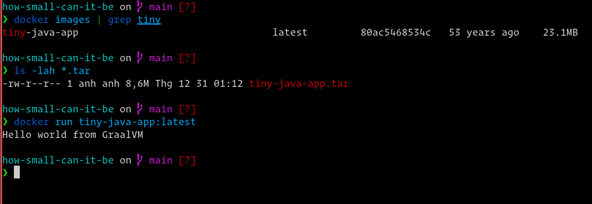

How small can it be?
--------------------

# Pretty damn small!

A demonstration using [GraalVM](https://www.graalvm.org/) native image, [melange](https://github.com/chainguard-dev/melange), [apko](https://github.com/chainguard-dev/apko) & [Wolfi Linux](https://github.com/wolfi-dev/os) to build a tiny tiny Java application.

The end goal is to see how small Java application container image can be.

## How?

- Since there's no GraalVM package for Wolfi Linux, I just need to quickly package it in a dirty way using [melange](https://github.com/chainguard-dev/melange).

- After that, I package [my application](./src/App.java) with melange again, using the `native-image` package from the Melange package I got earlier.

- Finally, I use [apko](https://github.com/chainguard-dev/apko) to produce the final container image. You can do multi-arch easily with apko along with other benefits like automatic SBOM generation, reproducible by default, etc.. but for the scope of this weekend hack, I just do `amd64` only.

```sh
make native-image-pkg
make tiny-java-app-pkg
make container
docker load < tiny-java-app.tar
docker run tiny-java-app:latest
```

## Result

The image is 23.1 MB decompressed and 8.6MB compressed.

```
docker images | grep tiny
tiny-java-app                                 latest         80ac5468534c   53 years ago    23.1MB
```



## License

Copyright 2023 Tuan Anh Tran <me@tuananh.org>

Permission is hereby granted, free of charge, to any person obtaining a copy of this software and associated documentation files (the "Software"), to deal in the Software without restriction, including without limitation the rights to use, copy, modify, merge, publish, distribute, sublicense, and/or sell copies of the Software, and to permit persons to whom the Software is furnished to do so, subject to the following conditions:

The above copyright notice and this permission notice shall be included in all copies or substantial portions of the Software.

THE SOFTWARE IS PROVIDED "AS IS", WITHOUT WARRANTY OF ANY KIND, EXPRESS OR IMPLIED, INCLUDING BUT NOT LIMITED TO THE WARRANTIES OF MERCHANTABILITY, FITNESS FOR A PARTICULAR PURPOSE AND NONINFRINGEMENT. IN NO EVENT SHALL THE AUTHORS OR COPYRIGHT HOLDERS BE LIABLE FOR ANY CLAIM, DAMAGES OR OTHER LIABILITY, WHETHER IN AN ACTION OF CONTRACT, TORT OR OTHERWISE, ARISING FROM, OUT OF OR IN CONNECTION WITH THE SOFTWARE OR THE USE OR OTHER DEALINGS IN THE SOFTWARE.